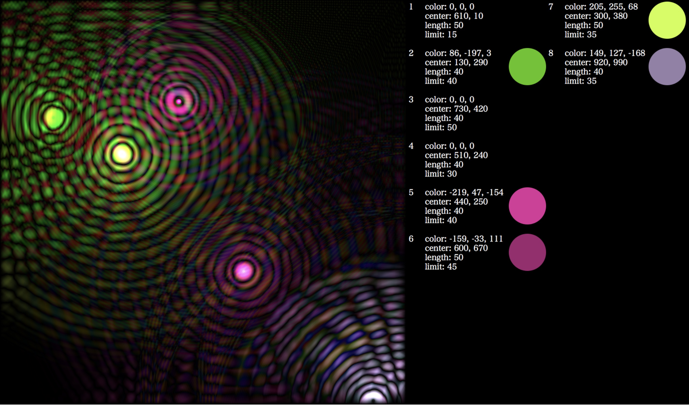

# something_like_mediaplyaer

windows media playerのように色波形を表示するもの．  
音楽との同期性はなく，色波形をランダムに表示するのみ．  

メインは左側に表示されている部分．  
右側は，現在生成されている色とRGB値(マイナスもあり)，xy座標，波長の長さ，生きている長さを表示．  

生成する波形の数は _wave_N_ で調整できる．  
右側のwave情報位置もそれに合わせてレイアウト．  

_decay_ が波の減衰率を表し，波の数によって _decay_ を低くする必要があるが，最適なものはわからない．

## example

